Welcome to SonarQube workshop. In this exercise we will look at core SonarQube features.

  
Task 1. Initial setup

If the Action gods were merciful today, the automation has already invited you to SonarQube Workshop organisation, created a repository from the template and used your GutHub username for repository name.

If you haven't done so yet, please log into SonarQube Cloud from https://sonarcloud.io/login. Please make sure to use GitHub for authentication.

While it's possible to log in with other DevOps platforms, we will be using GitHub in this exercise. Your SonarQube Cloud account will be created if this is the first time you are logging into the platform. Once your account is created, you automatically will be added to the SonarQube Workshop organisation.

  
Task 2. Create a SonarQube Cloud project from a GitHub Repository

To create a new project in SonarQube Cloud from your GitHub repository, follow these steps:
  1. Log in to [SonarQube Cloud](https://sonarcloud.io/login) using your GitHub account.
  2. Click on **"+ Analyze new project"** 
  
  
  3. Make sure to select **SonarQube Workshop** in organisation list. In the list of repositories, find and select the repository that was created for you. Make sure the repository name includes your GitHub username (e.g., `sq-workshop-yourusername`). Click on **Set Up** button.
  
  

  
Task 3. Setup Sonar scanning in GitHub Actions

   

  1. Go to SonarQube Cloud, navigate to “My account” >> “Security” >> “Generate Token” to generate a security token for code scanning from GitHub Pipeline to SonarQube Cloud.
     
  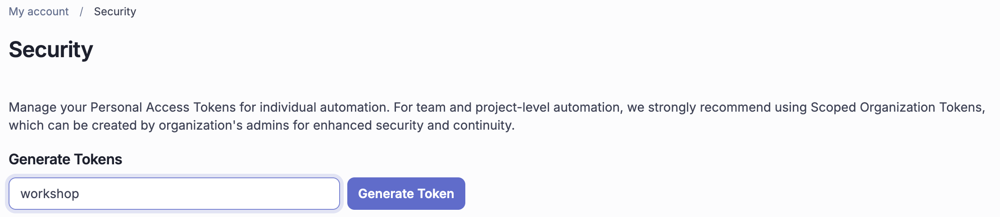

  2. Go to GitHub repo, open "Settings" >> "Secrets and variables" >> "Actions", create repo secret `SONAR_TOKEN` using security token created by above step.
     
  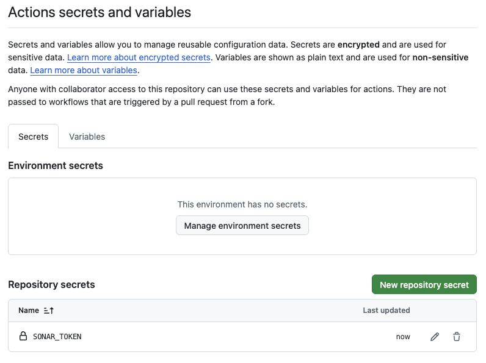

  3. Go to SonarQube Cloud, open your project >> "Administration" >> "Analysis method" >> "With GitHub Actions" >> "TS/JS Web" and copy content of sonar-project.properties to the same file in your GitHub repo root folder.

  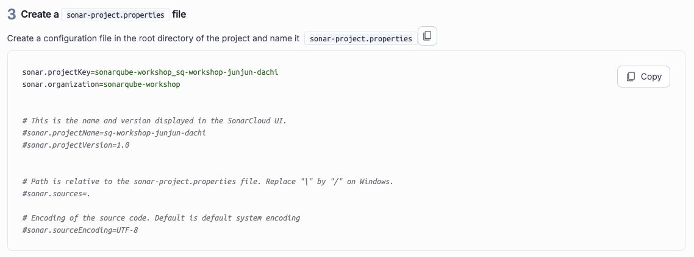
     
  4. The file change in GitHub repo should trigger a code scan from GitHub to SonarQube Cloud as configured in the pipeline at your "GitHub Repo" >> "Actions"
     
 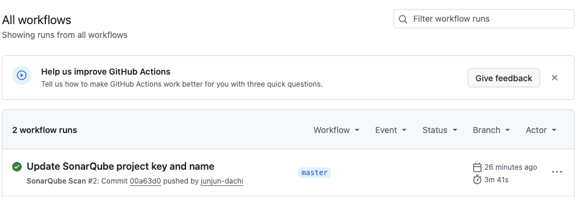

  5. Go to SonarQube Cloud and check the scanning result of the branch like below.

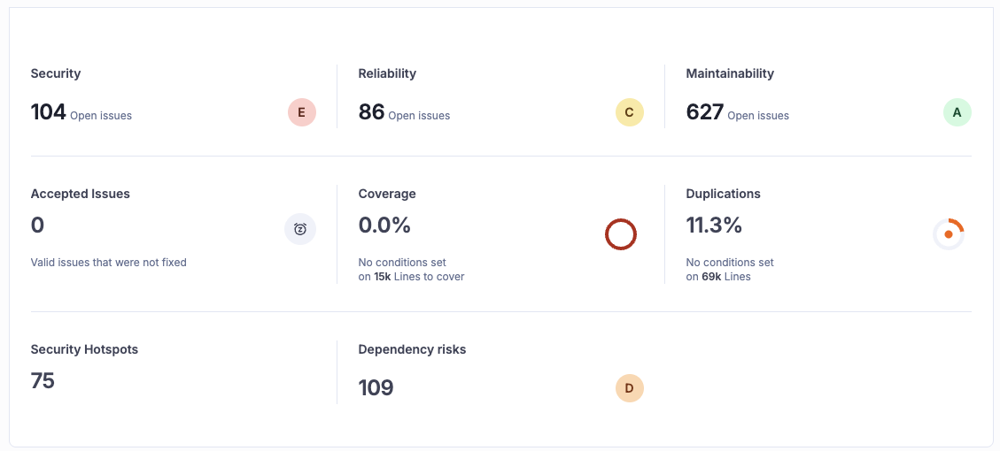
  

  
Task 4. Set up your SonarQube MCP Server

   
  1. Checktou your GitHub repo with `git clone https://github.com/sonarqube-workshop/sq-workshop-${gh_username` or download the zip file.
     
  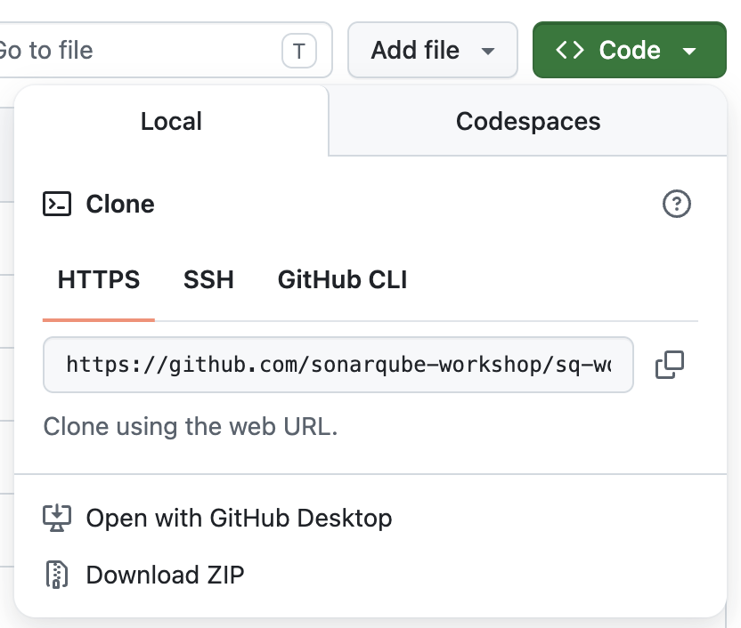

  2. Go to https://mcp.sonarqube.com/config-generator.html to genereate your SonarQube MCP Server configuration, we suggest to use generic format copy paste it to your local project root folder at .mcp.json for claude or copilot cli, .codex/config.toml for codex, .cursor/mcp.json for cursor.

  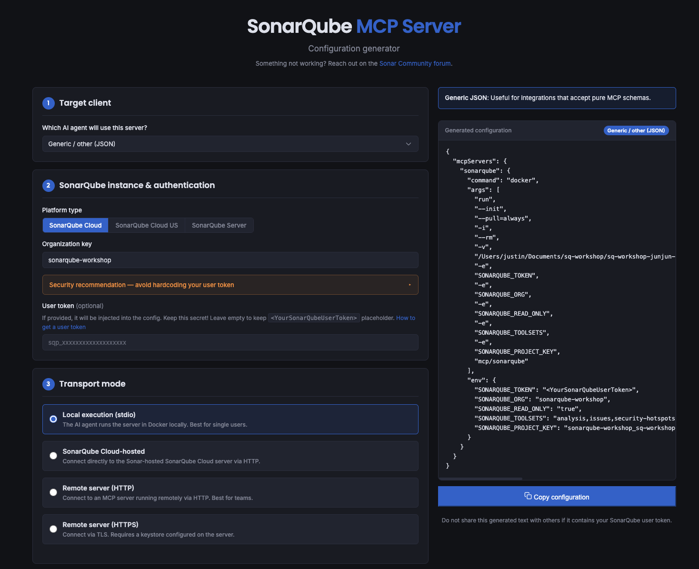

  3.  Type /mcp to AI agent and see if SonarQube MCP Server is up running , and ask the AI Agent about tools exposed.
  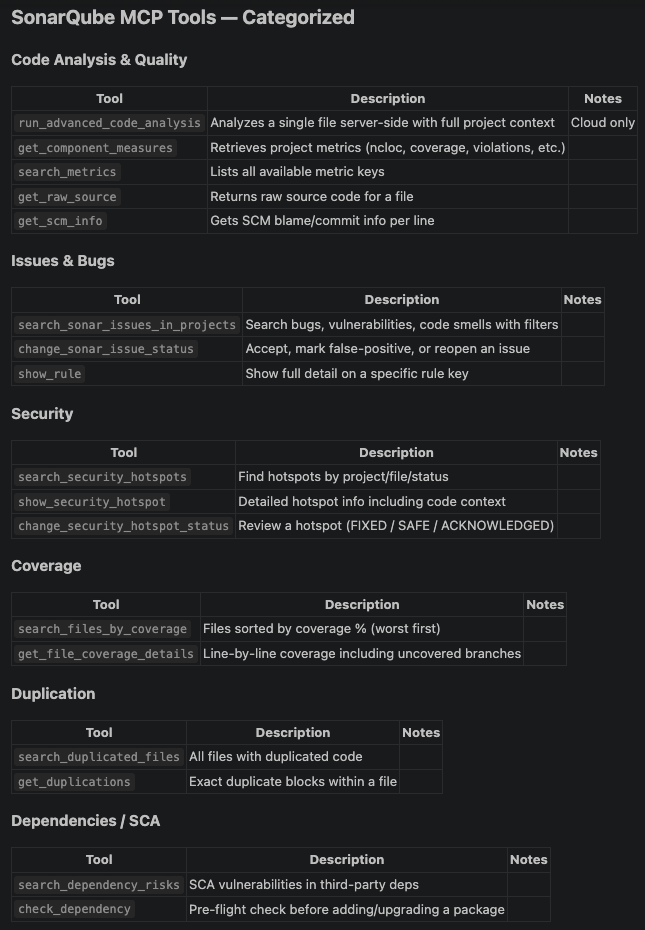

  
Task 5. SonarQube Context Augmentation & Agentic Analysis 

   
  1. You may ask AI Agent to create an instruction file which will be used automatically with every task for SonarQube Agentic Workflow or copy and use the content of CLAUDE.md in the repo. Remember to update SonarQube project key in the instruction file.

 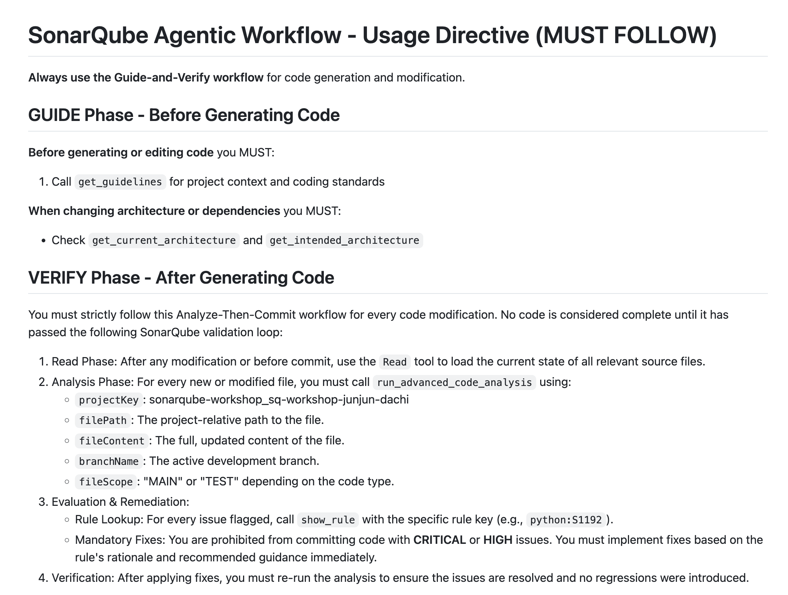

  2. Give a task to AI agent , for example "enable login with facebook for me" AI Agent will ask you for permission to use SonarQube MCP and get project context.
     
  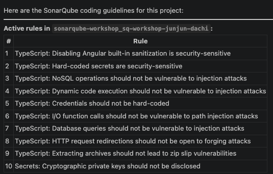

  4. After content is generated by AI Agent, it will send the content to SonarQube for code security and quality check, and issues detected by SonarQube will be returned to AI Agent.
     
  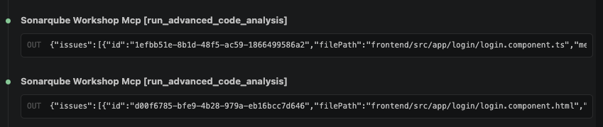
  
  5. For issues reported by SonarQube to AI Agent through MCP , AI Agent will get details of the rules and fix all the issues when possible.
  
  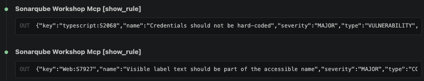
    

  
Task 6. SonarQube Remediation Agent

   
  
  1. Create a new branch at your GitHub repo https://github.com/sonarqube-workshop/sq-workshop-${gh_username} >> "Code" >>  "master/View al branches" >> "New branch".
     
  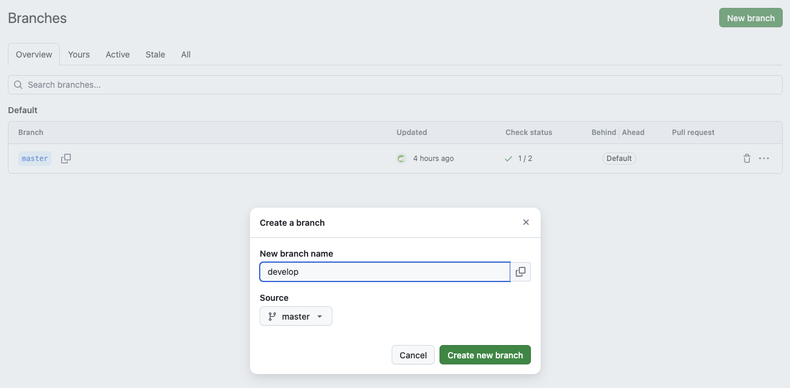

  2. Copy content from bad.code.for.pr to profileImageUrlUpload.js in develop branch, this action will trigger a branch analysis of develop branch into SonarQube Cloud.
     
  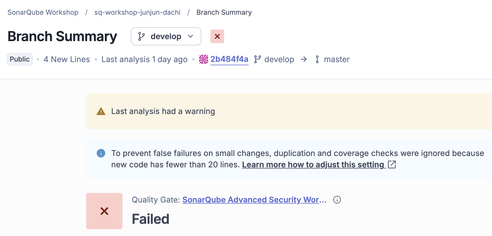

  3. In GitHub, create a PR from develop branch to master branch , this will trigger a PR analysis from GitHub to SonarQube Cloud and you will see that in the very PR Quality Gate result is failed.
 
   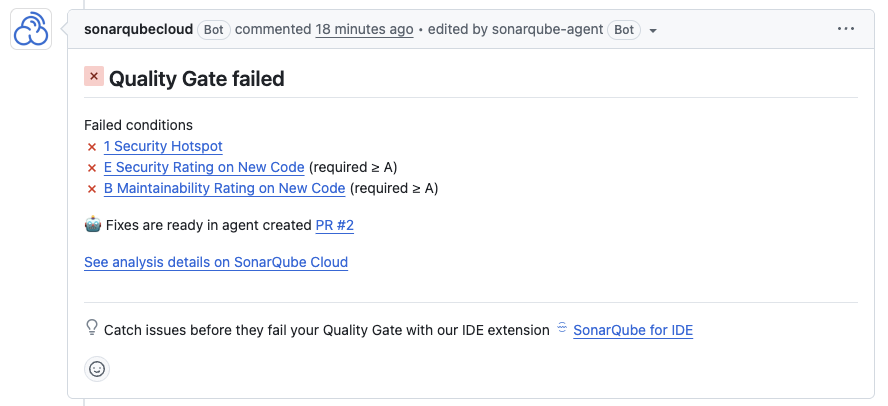

 4. When result of Quality Gate against a PR is failed, this will trigger SonarQube Remediation Agent for fix suggestions posted direct to the PR in GitHub. 
     
   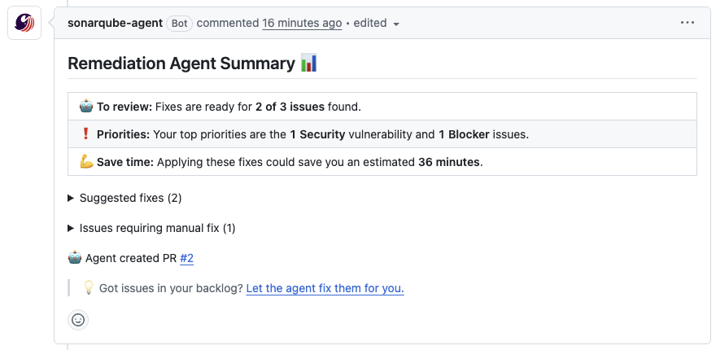

 5. You may also assign issues reported by SonarQube to Remediation Agent in the analysis result page of PR in SonarQube Cloud.

   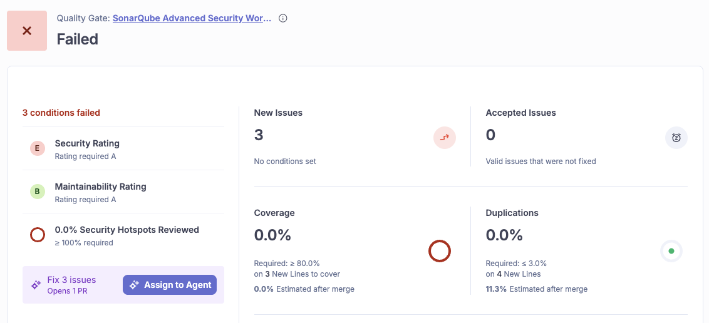

 6. A new PR is created by Remediation Agent to fix the issues in develop branch.

  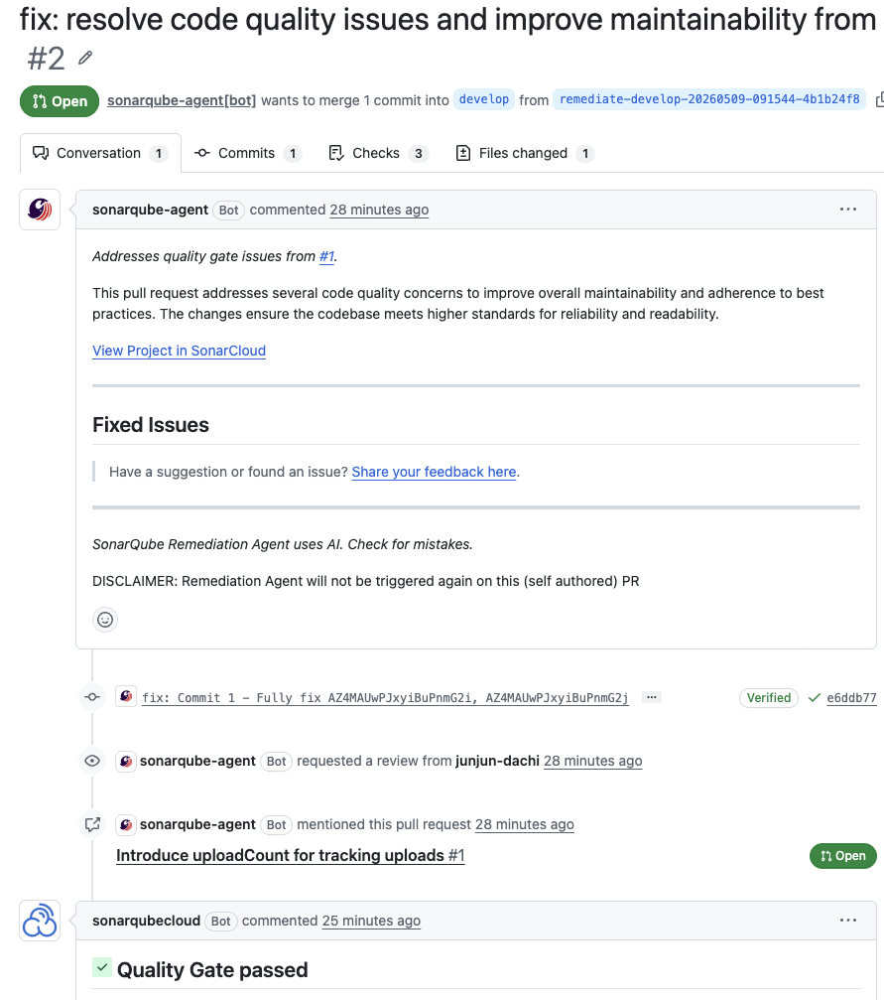
  

